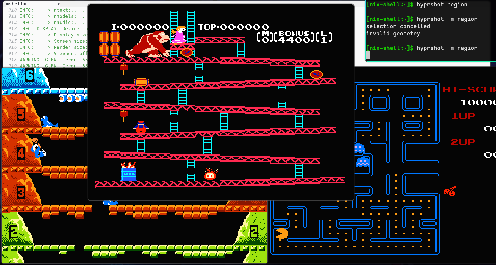

# nes-emulator



A Nintendo Entertainment System emulator.
Note: *The emulator is still under development, so it is not perfect.*

# How to build

First you should install xmake. (https://xmake.io/#/)
Then build it.
```bash
git clone https://github.com/yangyagami/nes-emulator.git
cd nes-emulator
xmake && xmake run nes-emulator your-rom-file.nes
```
